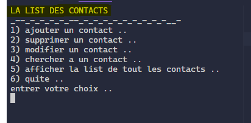
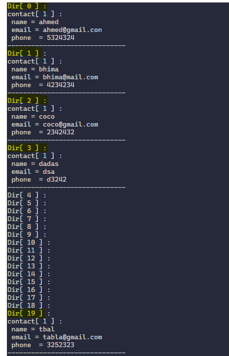

## Dir_data_structer
> un programe qui permet de la gestion d'une list des contacts trie selon l'ordre croissance avec les list chainnee

## Fonctionalite

- [x] consiltation 
- [x] recherche 
- [x] l'ajoute d'un nouvel contact
- [x] la suppresion d'un contact
- [x] la modification
- [x] la fermeture du programme

## L'execution de programme

 <h1 align="center">
   
 
   
</h1>
<h1 align="center">
   
 
   
</h1>
